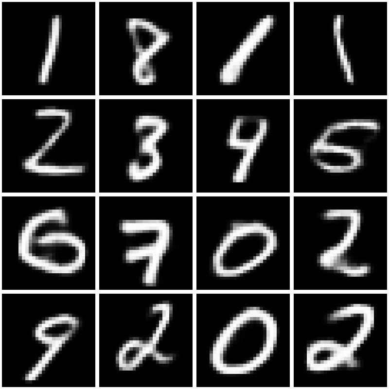

# Stable Diffusion Implementation on MNIST Dataset

## 📖 Project Overview
In this project, we implement a lightweight **Stable Diffusion framework**.  
The main components include:
- **VAE (Variational Autoencoder)**
- **DDPM (Denoising Diffusion Probabilistic Model)**

We use **CLIP’s text encoder** to extract text features and apply **cross-attention** to generate images conditioned on text. Thus, you should download CLIP project in **models/CLIP/**. Here we use clip-vit-base-patch32.
The model is trained on the **MNIST dataset** and can generate handwritten digit images based on the input digit text.

## 🚀 Usage
Run the following command to test:
```bash
python ./generating_test.py
```
Besides traditional DDPM sampling:
```bash
diffusion.ddpm_fashion_sample(unet_model, embeddings, 8, channels, batch_size=batch_size),
```
we also implement DDIM accelerated sampling, which can be invoked as:
```bash
diffusion.ddim_fashion_sample(unet_model, embeddings, 8, sampling_steps=50, channels=channels, batch_size=batch_size)
```

## 📊 Results
On the MNIST dataset, after training for 50 epochs with 1000 timesteps, we obtain the following results using 50-step DDIM sampling:
```bash
text_number = ['1', '8', '1', '1',
                   '2', '3', '4', '5',
                   '6', '7', '0', '2',
                   '9', '2', '0', '2']
```


## 📜 References
[DDPM](https://arxiv.org/abs/2006.11239)

[DDIM](https://openreview.net/pdf?id=St1giarCHLP)

[VAE](https://arxiv.org/pdf/1312.6114)

[Stable Diffusion](https://arxiv.org/abs/2112.10752)
